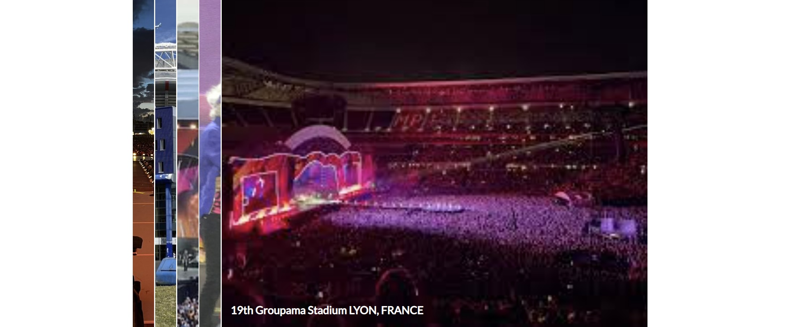

# The Rolling Stones

The Rolling Stones is a website dedicated to provide information on the worlds greatest rock band. The content
consists of basic information on the band itself as well as their discography and current tour.

## Features

In this section I will provide text and images of different features used. Website consists of navigation bar,

### Existing features

* Navigation bar
  * Placed at the top of our pages, with the red color marking the active page displayed. 
  
  * Navigation bar changed with background color and link color when we scroll down for 200px:
    
* Main split images on starting page
  * Two large images that expand when hovered on or collapse when we exit hover, or hover on another image.

* Members section
  * Section with images and information on the members of band
  
* Tour section
  * Section with dates and locations of the 2022. tour, which is in a form of clickable expandable image gallery.
  
* Sign up form
  * Sign up form to keep you updated on all Rolling Stones news
    
* Footer
  * Footer section located at the bottom of all our website and is split into two parts:
    * Our online shop.
    * Social links representing all main social sites, which will open in a new tab allowing users to return easy to our website.

### Features left to implement
* Sign up form
## UX/UI Section

### Site goal

The main goal of The Rolling Stones website is to provide users with the information on where they can see their favourite band, whether its on television or live 
concerts. It's very important that the information and navigation is well organized so that users can get all the information they don't have to go to any other 
website. Coding part should be done well so that new administrators can add or change concerts.

### Design choices
In the landing page we want to inform customers about our gym and all the features it provides. Our navigation bar should give basic idea to the users
what they need to achieve their dream body goal.
### User stories

#### As a new or existion customer
* I want to see the band on TV
* I want to see the band live in concert
* I want to get information on band members
* I want to sign up for more news

#### As a website administrator
* I want to provide users with information on band members
* I want to provide users with information on bands live concerts
* I want to users to see that we are well informed website
* I want users to sign up on our form
* I want to edit/add new nutrition data upon scientific research published

## Credits

### Content
### Media
* Banner left side image [Rolling Stones  at stereogum.com](https://www.stereogum.com/)
* Banner right side image [Rolling Stones  at youtube.com](https://www.youtube.com/)
* Members images [Rolling Stones  at stonesnews.com](https://https://stonesnews.com/)
  and [Rolling Stones  at rollingstones.com](https://www.rollingstones.com)