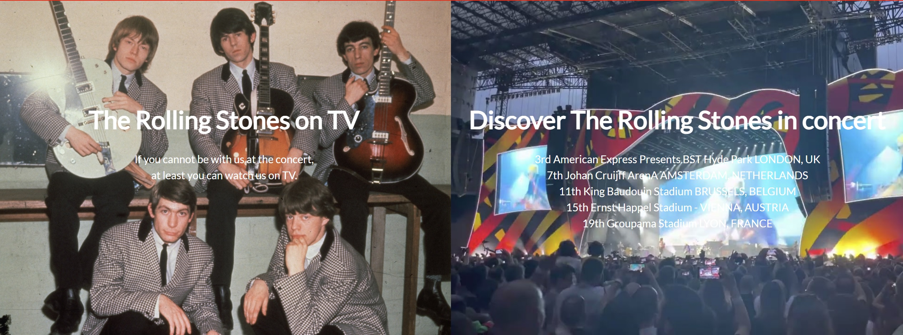

# The Rolling Stones

The Rolling Stones is a website dedicated to provide information on the worlds greatest rock band. The content
consists of basic information on the band itself as well as their discography and current tour.

## Features

In this section I will provide text and images of different features used. Website consists of navigation bar,

### Existing features

* Navigation bar
  * Placed at the top of our pages, with the red color marking the active page displayed. 
  
* Main split images on starting page
  * Two large images that expand when hovered on or collapse when we exit hover, or hover on another image.

* Members section
  * Section with images and information on the members of band
  
### Features left to implement
   
## UX/UI Section

## Credits

### Content
### Media
* Banner left side image [Rolling Stones  at stereogum.com](https://www.stereogum.com/)
* Banner right side image [Rolling Stones  at youtube.com](https://www.youtube.com/)
* Members images 
